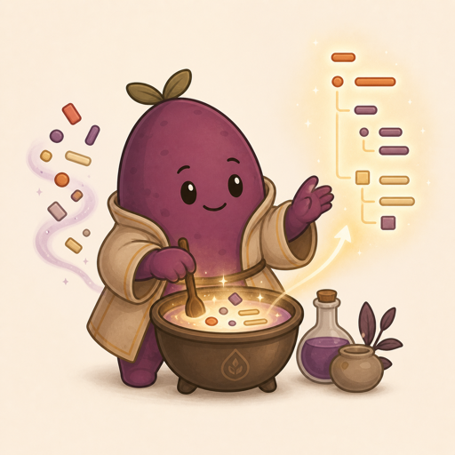

# Yamlchemy 🍠



Yamlchemy calculates values on a plain JS object with deterministic templates, expressions, local async bindings, and inline conditionals. It does not parse YAML — bring your own parser (`js-yaml`, `json5`, hand-built objects, whatever).

```ts
import { load as parseYaml } from "js-yaml";
import { load } from "./yamlchemy";

const yam = load(
  parseYaml(`
name: Ada
greeting: Hello {{name}}
score: -> 1 + 2
names:
  - Ada
  - Grace
firstName: "{{get('names.0')}}"
loud: "{{shout(name)}}"
allNames: -> select("names.*")
line: |
  <<lookup:result name Ada>>
  {{#if result == "ok"}}
    passed
  {{else}}
    failed
  {{/if}}
`),
  {
    seed: 123,
    fn: {
      shout: (s) => String(s).toUpperCase(),
    },
    io: {
      async lookup(params) {
        const row = await db.find(params.pairs.name);
        return row ? "ok" : "no";
      },
    },
  },
);

await yam.calc("greeting"); // "Hello Ada"
await yam.calc("score"); // 3
await yam.calc("allNames"); // ["Ada", "Grace"]
await yam.evaluate("get('names.0')"); // "Ada"
await yam.calc("greeting", { name: "Grace" }); // "Hello Grace"
yam.has("names.0"); // true
yam.raw("greeting"); // "Hello {{name}}"
await yam.calcAll();

const { values, undo } = await yam.update(
  {
    "relations.{{other}}.emotions.arousal": "-> incr(this)",
    emotions: { arousal: "-> incr(this) + 2.5" },
  },
  { other: "sarah" },
);
yam.restore(undo);
yam.clear();
```

## Syntax

### Pure layer: `{{...}}`

- `{{expr}}` evaluates expressions against object keys, params, local bindings, and built-in helpers. Pure — no PRNG, no counters, no I/O.
- `get("path.to.value")` reads one calculated path and returns `null` when missing.
- `select("path.*.value")` reads calculated wildcard matches and always returns an array. `*` matches one object key or array index.
- `-> expr` makes a string value calculate directly to the expression value. The expression source may embed `{{...}}` and `<<...>>` (so the impurity is still visible in the source).
- `opts.fn` registers sync helpers callable from `{{...}}` expressions (e.g. `shout(name)`).
- `{{#if expr}}...{{elseif expr}}...{{else}}...{{/if}}` renders the first matching block.
- A property whose value is a function is invoked as `(vars, handle) => SerialValue | Promise<SerialValue>`, where `vars` are the caller-passed vars from `calc(path, vars)` (or `calcAll`/`peek`/`update`) and `handle` is the loaded handle. The return value is recursively calculated, so functions can return template strings, nested objects, or `-> expr` strings.

### Impure layer: `<<...>>`

Everything that mutates state — PRNG advancement, counter bumps, I/O — uses chevrons. Authors can grep `<<` to find every site that breaks reproducibility.

- `<<name args>>` calls `opts.io.name(params, handle)` (sync or async) and inserts the result. The legacy `<<#name args>>` form still works. When the field value is a single directive with no surrounding text (e.g. `field: <<lookup id 7>>`), the raw return value is preserved — objects, arrays, numbers, etc. pass through unchanged. When embedded in a larger string, the result is stringified (objects/arrays via `JSON.stringify`).
- `<<name:binding args>>` stores result in a local binding for the rest of the current string and inserts nothing. The binding holds the raw value, so subsequent `{{binding}}` or `{{binding.field}}` expressions can read object/array fields directly.
- Built-in variation pickers (split parts on `|`): `<<rand A|B|C>>` (PRNG), `<<cycle A|B|C>>`, `<<seq A|B|C>>` (stops at last), `<<once A|B|C>>` (visits each once then `""`). Cycle/seq/once use a counter keyed on the directive body.
- Built-in rand value generators: `<<random>>` (float 0–1), `<<randint min max>>`, `<<randfloat min max>>`, `<<randnormal min max>>`, `<<randintnormal min max>>`, `<<dice sides=6>>`, `<<coin prob=0.5>>`, `<<roll count sides=6>>`. Builtin names take precedence over `opts.io` entries.

`calc(path)`, `calcAll()`, and `evaluate(expr)` are async. Each accepts an optional vars object that overlays the loaded params for that call. Use `fork(opts)` to create a new handle with merged options. `evaluate(expr)` runs the expression language directly against the calculated state (no directive processing — directives only fire while rendering field values). Missing paths and variables evaluate to `null`; bad expressions, unknown directives, and circular dependencies throw.

`update(patch, vars?, opts?)` mutates the loaded state and returns `{ values, undo }`. `values` is the resolved path/value map that was written. `undo` is a serializable snapshot for `restore(undo)`, recording prior values, created paths, and a revision guard. PRNG state and cycle counters are NOT tracked in undo — randomness is an explicit side effect (the `<<>>` is the signal) and not rolled back. Restore patches are LIFO: restore the newest successful update first, then earlier updates. Patch keys are dotted paths (key templates may interpolate `{{vars}}` and contain `*` wildcards). Add `+` to a path to merge/append/concat instead of replace: objects deep-merge, arrays append, and strings concatenate. Patch values are plain literals or template strings (`-> expr`, `{{...}}`, `<<...>>`); inside a template, `this` is the current calculated value at that path. All `this` snapshots are read before any writes. Missing paths are created by default; pass `opts.create: false` to throw instead. `clear()` resets state to the originally loaded values.

## One-shot helpers

Use `evaluate(expr, opts?)` to run a single expression without a source object. Use `render(template, opts?)` for a single template string with full `{{...}}`, `<<...>>`, and conditionals. Both accept the same options as `load` (`seed`, `cycle`, `params`, `fn`, `io`).

```ts
import { evaluate, render } from "./yamlchemy";

await evaluate("x + y", { params: { x: 5, y: 10 } }); // 15
await evaluate("shout(name)", {
  params: { name: "ada" },
  fn: { shout: (s) => String(s).toUpperCase() },
}); // "ADA"

await render("solution: {{foo + bar}}", { params: { foo: 1, bar: 2 } });
// "solution: 3"

await render("{{#if x > 0}}pos{{else}}neg{{/if}}", { params: { x: 5 } });
// "pos"

await render("<<lookup id 7>>", {
  io: { async lookup(p) { return db.find(p.pairs.id); } },
});
```

`render` returns the raw value when the template is a single directive (e.g. `<<obj>>` returning an object); otherwise the result is stringified.

## License

Copyright 2026 Matthew Trost.

Licensed under the Apache License, Version 2.0. See [LICENSE](./LICENSE).
